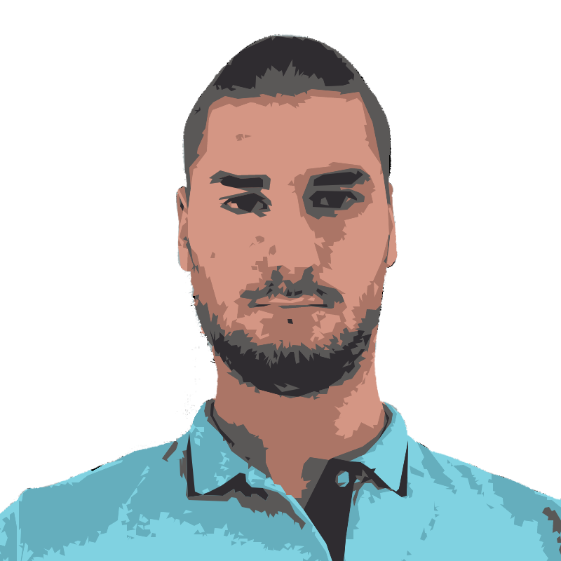

<head><meta name="google-site-verification" content="LyDN168VoMj2__LPxm10D8nM6CxHicRpATu1Yf7NV4w" /></head>
<h2> Hi, I'm Aleksa Čavić! </h2>

<p><em>Studying in <a href="https://singidunum.ac.rs/upis/study-programme/informatika-i-racunarstvo">Singidunum University</a></br>
👉 Check my <a href="https://aleks4k.github.io/portfolio/">portfolio</a> 
</em></p>

[](https://www.linkedin.com/in/aleksa-cavic/)
[](https://github.com/Aleks4k)


### Something more...  

```javascript
const aleks4k = {
  code: [Javascript, HTML, CSS, Java, Python, Pawn, C, LUA],
  unfinishedProjects: []
}
```
---
